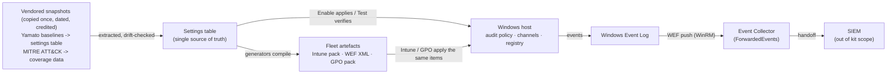

# Architecture

How the kit works under the hood, in one picture. The claim it makes:
**everything derives from a single settings table,
snapshots come in once with their dates recorded, and events flow out to
your collector - the kit never talks to the internet at runtime.**

Reading it left to right:

- **Snapshots in**: the Yamato baselines were extracted once into the
  settings table, and the MITRE ATT&CK data into the coverage mapping
  (`data/attack/`) - two separate destinations, each with source, version
  and date recorded (`data/*/README.md`); CI drift-checks everything
  generated from them.
- **One table**: every script - the builder, Enable, Test, the coverage
  report and all three fleet generators - dot-sources
  `LoggingBaseline.Settings.ps1`, so applied config, deployed artefacts and
  verification can never disagree.
- **Events out**: hosts write to the Windows Event Log service;
  [Windows Event Forwarding](https://learn.microsoft.com/windows/security/operating-system-security/device-management/use-windows-event-forwarding-to-assist-in-intrusion-detection)
  carries selected channels over WinRM to a collector's ForwardedEvents
  log; your SIEM picks up there, deliberately outside the kit.

Which application each piece touches: Enable/Test drive `auditpol.exe`,
`wevtutil.exe`, the registry and the SMB configuration cmdlets; the Intune
pack is consumed by **Microsoft Intune** (Scripts and remediations); the
subscription XML by the **Windows Event Collector** (`wecutil`); the GPO
pack by **GPMC / LGPO.exe**; and WELA runs as an independent checker
alongside Test.
