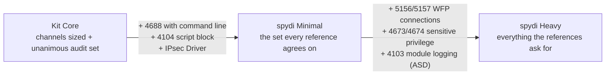

# Baselines & Presets

## The model

The settings table (`LoggingBaseline.Settings.ps1`) is the single source of
truth: every channel, audit subcategory, registry value and SMB audit
setting, each with a plain-language purpose, a tier, a scope, behaviour
category tags and - where it matters - a volume/stability risk note.

Everything else is a **selection** of that table:

| Selection mechanism | When to use |
|---|---|
| Tier switches (`-IncludeHighVolume`, `-IncludeOptional`) | Fastest route to the recommended baseline |
| A selection CSV from `New-LoggingBaseline.ps1` | Per-setting control, per-role baselines, review in Excel/git |
| A shipped preset (`presets\*.csv`) | Start from a published reference baseline |

One selection drives everything: Enable, Test, the Intune pack, the WEF
subscription, the GPO pack and the ATT&CK coverage report all accept the
same `-BaselineFile`.

## Tiers

| Tier | Default | Contents |
|---|---|---|
| Core | applied | everything with low or justified volume |
| HighVolume | ask first | process creation + command line, PowerShell script block + module logging, WFP connections, sensitive privilege use |
| Optional | ask first | PowerShell transcription, Crypto-DPAPI debug channel, IPsec Driver auditing |

The split exists so volume decisions are made by a human with the impact in
front of them - `Export-AttackCoverage.ps1` quantifies what the HighVolume
tier buys (117 additional ATT&CK techniques over Core: 162 -> 279 of the
284-technique native ceiling; see [the mapping page](mapping.md)).

## Building a baseline

```powershell
.\New-LoggingBaseline.ps1
```

Walks every item: recommendation shown as the default (Enter accepts), risk
notes in yellow, `a` accepts defaults for the rest of a section, `t` shows
the **baseline tree** - every item's include/exclude state plus a
per-category coverage count, with uncovered categories in red. The output
CSV is plain text: flip `Selected` between Y/N in Excel, commit it per
server role, and you have reviewable, versioned logging baselines.

Audit any CSV later:

```powershell
.\New-LoggingBaseline.ps1 -Show -BaselineFile .\FileServerBaseline.csv
```

## Shipped presets

`presets\` contains published reference baselines expressed as selections,
faithful to the scripts in Yamato's
[EventLog-Baseline-Guide](https://github.com/Yamato-Security/EventLog-Baseline-Guide):

| Preset | Source | Items selected |
|---|---|---|
| `ASD.csv` | Australian Signals Directorate | 25 |
| `Microsoft_Client.csv` | Microsoft client OS recommendation | 15 |
| `Microsoft_Server.csv` | Microsoft server OS recommendation | 17 |

Faithfulness limits (stated, not hidden): the kit applies its own
Success/Failure flags and channel sizes, which superset the references in
places (one exception: ASD sizes Security at 2 GB versus the kit's 1 GB);
five ASD subcategories cannot be expressed because Yamato's own baseline
excludes them (Process Termination, Group Membership, and the
SACL-dependent File System / Kernel Object / Registry). The presets are
regenerated by `tools\New-PresetBaselines.ps1` and CI fails if the
committed CSVs drift from the settings table.

WELA's matching `-Baseline` names (`ASD`, `Microsoft_Client`,
`Microsoft_Server`) serve as the independent verifier for these presets.

## Per-role presets

The kit's recommended *starting point* per host role - Core plus the
high-value items that role can afford, with every hold-back justified by the
settings table's own Risk notes. These are starting points pending pilot
volume data, not final answers: run the pilot week, check the numbers, and
adjust your copy.

| Preset | Selection | Observable techniques |
|---|---|---|
| `role_Workstation.csv` | Core + process creation/cmdline + script block logging + WFP connections; DC-only items deselected | **265** of 472 mapped = 93% of the 284 native ceiling |
| `role_MemberServer.csv` | as Workstation, **without** WFP connections | **263** of 472 = 93% of ceiling |
| `role_DomainController.csv` | as MemberServer, plus the DC-scope subcategories | **273** of 472 = 96% of ceiling |

The reasoning per decision (volume and behaviour characterisations come from
the settings table's Risk notes, themselves sourced from
[Microsoft's advanced audit policy documentation](https://learn.microsoft.com/windows-server/identity/ad-ds/plan/security-best-practices/advanced-audit-policy-configuration)
and the Yamato guide):

| Item | Wks | Member | DC | Why |
|---|---|---|---|---|
| Process creation + command line | ✓ | ✓ | ✓ | Highest single detection value; volume scales with process churn - watch RDS/build hosts in the pilot |
| Script block logging (4104) | ✓ | ✓ | ✓ | Moderate volume, de-obfuscated code, generally safe fleet-wide per its Risk note |
| WFP connections (5156/5157) | ✓ | - | - | Client connection volume is modest; documented **High** volume on connection-heavy servers and DCs |
| Module logging (4103) | - | - | - | The heaviest setting in the kit; opt-in after a pilot, everywhere |
| Sensitive Privilege Use | - | - | - | Known to flood with backup agents; opt-in per server role after a pilot |
| DC-scope subcategories | - | - | ✓ | Only generate events on domain controllers |
| Optional tier (transcription, DPAPI debug, IPsec Driver) | - | - | - | Situational by definition |

Usage is identical to any baseline CSV:

```powershell
.\New-LoggingBaseline.ps1 -Show -BaselineFile .\presets\role_Workstation.csv
.\Enable-LoggingBaseline.ps1 -BaselineFile .\presets\role_MemberServer.csv -WhatIf
.\New-IntuneRemediationPack.ps1 -BaselineFile .\presets\role_Workstation.csv -OutDir .\Intune\Workstation
```

To customise a role, copy the CSV, flip `Selected` values in Excel, and keep
your copy in version control - the shipped presets are regenerated from the
settings table and CI rejects drift, so edit copies, not the originals.

## spydi baselines - the blended recommendation

The `spydi_*` presets blend the four references this kit tracks - ASD,
Microsoft Client, Microsoft Server and Yamato - into one opinionated pair of
axes: **role** (Server covers servers, domain controllers and WEF collectors
in one preset, with DC-only items runtime-gated; Workstation covers
Windows 10/11) and **volume** (Minimal vs Heavy). The one picture that shows
what you're choosing between:



| Preset | Observable techniques (native ceiling 284) |
|---|---|
| `spydi_Workstation_Minimal.csv` | 263 of 472 = 93% of ceiling |
| `spydi_Workstation_Heavy.csv` | 269 of 472 = 95% |
| `spydi_Server_Minimal.csv` | 273 of 472 = 96% |
| `spydi_Server_Heavy.csv` | **279 of 472 = 98% - the full native reach** |

Every group traced to its sources (A = ASD, C = Microsoft Client,
S = Microsoft Server, Y = Yamato) and key events:

| Group | Key events | Refs | Minimal | Heavy |
|---|---|---|---|---|
| Channels sized + enabled (kit Core set) | 4104, 7045, 104, task/WMI/Defender logs | Y (A sizes Sec/Sys/App) | ✓ | ✓ |
| Account logon + Kerberos (DC) | 4776, 4768/4769/4771 | A,C,S,Y | ✓ | ✓ |
| Account and group management | 4720-4767, 4727-4764 | A,C,S,Y | ✓ | ✓ |
| Logon/logoff set | 4624/4625/4648, 4634, 4672, 4778/4779 | A,C,S,Y | ✓ | ✓ |
| Policy change + system set | 4719, 4706, 4616, 4697, 5038 | A,C,S,Y | ✓ | ✓ |
| Process creation + command line | 4688 | A,C,S,Y | ✓ | ✓ |
| Script block logging | 4104 | A,Y | ✓ | ✓ |
| IPsec Driver | 4960-4963, 5478+ | C,S | ✓ | ✓ |
| DS Access/Changes (Server preset; DC-gated) | 4662, 5136 | S,Y | ✓ | ✓ |
| NTLM + SMB (2025) auditing | 8001-8004, 3021/3022, 31998/31999 | Y, Microsoft docs | ✓ | ✓ |
| WFP connections | 5156/5157 | Y | - | ✓ |
| Sensitive privilege use | 4673/4674 | Y | - | ✓ |
| Module logging | 4103 | A | - | ✓ |

Notes, stated plainly:

- **Minimal** is the deploy-with-confidence set: everything unanimous plus
  the three highest-signal additions. **Heavy** accepts real volume for the
  last stretch of coverage and richer content (4103 command output, network
  flow context) - pilot Heavy on one host per role first, per the
  [safety page](safety.md).
- Module logging appears only in Heavy, on ASD's authority - it is the
  kit's heaviest setting.
- Selection CSVs carry item choices, not sizes: the Security log stays at
  the kit's 1 GB (ASD suggests 2 GB; raise it in
  `LoggingBaseline.Settings.ps1` if you take that view).
- The ASD subcategories the kit cannot express (Process Termination, Group
  Membership, SACL-dependent File System/Kernel Object/Registry) are the
  same ones listed under the ASD reference preset above.
- Sources beyond the four: ASD's 2024 joint
  [Best practices for event logging and threat detection](https://www.cyber.gov.au/resources-business-and-government/maintaining-devices-and-systems/system-hardening-and-administration/system-monitoring/best-practices-event-logging-threat-detection)
  validates this set at the practice level (PowerShell logging, command
  line capture, centralised collection); NIST SP 800-92 / CSF and CIS
  Benchmarks are governance or licence-restricted comparisons, cited rather
  than vendored; a DISA STIG preset is a roadmap candidate (public domain,
  subcategory-level).
